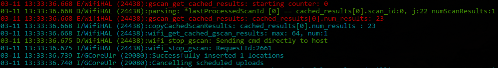

# logcat
The aim of this short script is to parse the output from adb's logcat function and color code it. It will take in a couple of arguments that you would normally pass to adb (-d, -s and -filter for custom filtering)

###Usage
```
Usage of logcat:
  -d	Read logcat from device (default true)
  -filter string
    	Filters to use for adb, e.g. "*:S AndroidRuntime:E YourApp:*"
  -s string
    	Serial Number for the Device to read logcat from
```

###Example of Output

